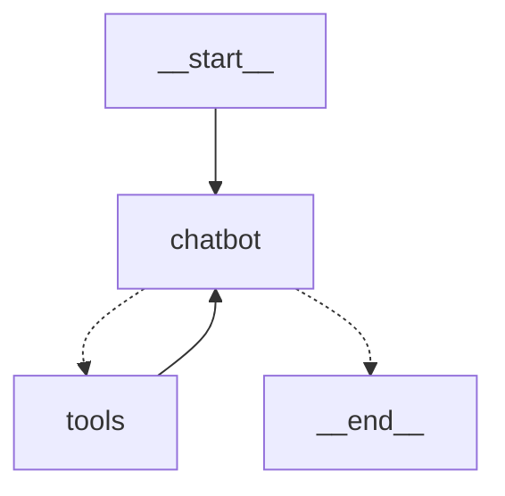

# MCP + LangGraph Agent

This is a minimal, functional example of an **agent powered by LangGraph** with tools implemented using **MCP (Model Context Protocol)** servers instead of traditional LangChain tools. It's based on the official [LangGraph tutorial](https://langchain-ai.github.io/langgraph/tutorials/introduction/), adapted to demonstrate how to integrate MCP servers as tools.

> 🧠 Use this repo as a **skeleton** to quickly build your own LangGraph agent with MCP tools!

## Features



*   Integrates LangGraph for managing agent state and message routing.
*   Uses MCP servers to provide access to tools.
*   Includes example MCP servers for math and weather.
*   Provides a command-line interface for interacting with the agent.

## Installation

1.  Clone the repository:

    ```bash
    git clone <repository_url>
    ```
2.  Install the dependencies using Poetry:

    ```bash
    poetry install
    ```

## Usage

1.  Set the Anthropic API key in the `.env` file. You may need to create this file if it doesn't exist. For example:

    ```
    ANTHROPIC_API_KEY=your_api_key
    ```
2.  Start the MCP servers:

    *   Math server: `python src/mcp_servers/math_server.py`
    *   Weather server: `python src/mcp_servers/weather_server.py`
2.  Run the agent:

    ```bash
    poetry run main
    ```

    This will start the agent in interactive mode. You can then enter prompts, and the agent will respond using the tools provided by the MCP servers.

## Example

```
User: What's (3 + 5) x 12?
Assistant: The result of (3 + 5) × 12 = 96
User: What is the weather in New York?
Assistant: It's always sunny in New York.
```

## MCP Server Configuration

The MCP servers are configured in `src/main.py`. You can modify the configuration to add or remove servers, or to change the transport mechanism.

## LLM Configuration

The LLM used by the agent can be changed in `src/common.py`.
